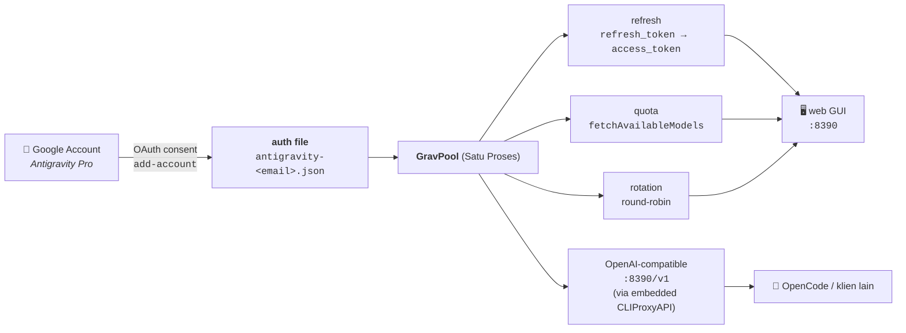

<p align="center">
  
  
  
  
</p>

<h1 align="center">GravPool</h1>
<p align="center"><b>Kelola akun Google Antigravity Pro sebagai pool kredensial OAuth</b><br>
refresh otomatis · monitoring kuota live · rotasi akun · web dashboard</p>

---

## Apa ini?

GravPool mengubah satu atau beberapa akun **Google Antigravity Pro**
menjadi *credential pool* yang bisa di-refresh, dimonitor kuotanya, dan
dirotasi — lalu dipakai lewat endpoint OpenAI-compatible (CLIProxyAPI) di
depan model Gemini 3 / Claude Sonnet / GPT.

Tanpa dependency apa pun (pure Python stdlib). Teruji live terhadap akun Pro
(Okt 2026).

---

## 📖 Daftar isi

- [Alur kerja](#-alur-kerja)
- [Quickstart](#-quickstart)
- [Fitur](#-fitur)
- [Struktur proyek](#-struktur-proyek)
- [CLI reference](#-cli-reference)
- [Schema auth file](#-schema-auth-file)
- [Integrasi](#-integrasi)
- [Catatan](#-catatan)

---

## 🔁 Alur kerja



**Ringkasnya:** akun Google → token OAuth → disimpan sebagai JSON →
pool ini yang ngurusin refresh + kuota + rotasi → dipakai lewat endpoint
OpenAI-compatible di OpenCode atau tool apa pun.

---

## ⚡ Quickstart (Satu Bundle)

Instalasi dan konfigurasi sekarang jadi satu alur otomatis yang menyatukan proxy dan dashboard dalam satu port.

```bash
# a. clone (atau download ZIP)
git clone https://github.com/ghostedmyself/gravpool.git
cd gravpool

# b. jalankan bundle untuk download proxy
./install.sh   # atau install.bat di Windows, atau `python bundle.py --no-login`

# c. login akun Google (lakukan sekali)
python -m gravpool.cli add-account --auth-dir auth

# d. jalankan dashboard + proxy secara bersamaan
python -m gravpool.cli gui --auth-dirs auth
```

Setelah itu:
- Buka dashboard di http://127.0.0.1:8390
- Arahkan OpenAI client apa pun ke endpoint `http://127.0.0.1:8390/v1` dengan API key `sk-local`

> Kredensial OAuth publik sudah **built-in** — tidak perlu copy/edit file creds.
> Mau pakai client sendiri? export `ANTIGRAVITY_CLIENT_ID` / `ANTIGRAVITY_CLIENT_SECRET`
> atau isi `gravpool/_local_creds.py`.

---

## ✨ Fitur

| Kategori | Fitur | Modul |
|---|---|---|
| 🔑 **OAuth** | refresh token otomatis, login akun baru (1-command browser), userinfo | `oauth.py`, `login_flow.py` |
| 📊 **Kuota** | `fetchAvailableModels` live, snapshot JSON, cache | `quota.py` |
| 🔄 **Rotasi** | round-robin thread-safe, auto-skip akun mati, auto-refresh | `rotate.py` |
| 🧩 **Combo** | model virtual `fallback`/`fusion`, auto-skip kuota habis | `combo.py` |
| 💾 **Storage** | model auth file CLIProxyAPI-compatible, scan + expiry | `store.py` |
| 🖥️ **GUI** | dashboard web zero-dep, proxy terintegrasi — dashboard + `/v1` satu port | `web.py` |
| ⌨️ **CLI** | `status` / `quota` / `refresh` / `gui` / `add-account` / `combo` / `login-binary` | `cli.py` |

---

## 📁 Struktur proyek

```
gravpool/
├── gravpool/                    # paket inti (stdlib only)
│   ├── constants.py             #   OAuth client + endpoint (publik, built-in)
│   ├── store.py                 #   model & scan auth file
│   ├── oauth.py                 #   refresh / login / userinfo
│   ├── login_flow.py            #   login 1-command (browser callback)
│   ├── combo.py                 #   virtual model combo (fallback/fusion)
│   ├── quota.py                 #   fetchAvailableModels + snapshot
│   ├── rotate.py                #   round-robin rotator
│   ├── web.py                   #   dashboard web zero-dep
│   ├── cli.py                   #   antarmuka command-line
│   ├── _local_creds.py.example  #   template kredensial (opsional, GITIGNORED)
├── install.sh / install.bat     # installer 1-command (cek Python + login)
├── bundle.py                    # one-command bundle (login + download proxy + config)
├── examples/
│   └── opencode.json            # config provider OpenCode siap pakai
├── docs/
│   ├── install.md               # panduan instalasi satu-bundle
│   └── opencode.md              # panduan integrasi OpenCode
├── static/                      # aset statis UI dashboard
├── CHANGELOG.md                 # riwayat perubahan (Keep a Changelog)
├── pyproject.toml               # metadata paket
├── LICENSE                      # MIT
└── README.md
```

---

## 🛠️ CLI reference

| Perintah | Fungsi |
|---|---|
| `status` | tampilkan state token tiap akun (ok / expired / disabled) |
| `quota` | ringkasan kuota per akun; `--out file.json` untuk snapshot penuh |
| `refresh` | refresh semua token yang expired |
| `gui` | jalankan dashboard web dan embedded proxy (`--host` / `--port`). Gunakan `--no-proxy` untuk mematikan proxy. |
| `add-account` | login akun baru 1-command: browser consent → callback → simpan auth file |
| `combo` | kelola virtual model combo: `list` / `add` / `rm` / `resolve` |
| `login-binary` | tambah akun baru lewat flow login bawaan `cli-proxy-api` |

Semua perintah menerima `--auth-dirs DIR [DIR ...]` untuk menunjuk lokasi
auth file (default `/root/.cli-proxy-api*` di server).

### Login akun baru (tanpa binary)

```bash
# 1 command, langsung buka browser untuk consent Google:
python -m gravpool.cli add-account

# kalau di server headless (browser tidak bisa dibuka otomatis):
python -m gravpool.cli add-account --no-browser   # print URL, paste manual
```

### Combo (virtual model dengan fallback otomatis)

```bash
# buat combo fallback: kalau gemini-3-pro kuota habis → claude-sonnet-4-6
python -m gravpool.cli combo add main gemini-3-pro claude-sonnet-4-6

# lihat daftar + resolve terhadap kuota live:
python -m gravpool.cli combo list
python -m gravpool.cli combo resolve main

# hapus combo:
python -m gravpool.cli combo rm main
```

`kind` bisa `fallback` (coba berurutan, pindah saat kuota habis) atau `fusion`
(gabung semua model yang tersedia). Kelola combo juga bisa dari dashboard web.

---

## 📄 Schema auth file

Satu file per akun, **CLIProxyAPI-compatible** (drop-in):

```jsonc
{
  "access_token":  "ya29.…",              // token akses (diputar oleh oauth.py)
  "disabled":      false,                 // skip dari rotasi
  "email":         "user@gmail.com",      // identitas akun
  "expired":       "2026-10-01T13:01:06Z",// ISO8601 UTC, di-parse store.py
  "expires_in":    3599,                  // detik
  "project_id":    "aicode-consumers",    // project Google tetap
  "refresh_token": "1//0g…",              // RAHASIA — jaga dir 0700
  "timestamp":     1790856067175,         // epoch ms
  "type":          "antigravity"          // identitas provider
}
```

---

## 🌐 OpenAI-compatible endpoint

Endpoint OpenAI-compatible sekarang terintegrasi langsung ke dalam proses GUI (melalui *child process* CLIProxyAPI yang di-reverse proxy secara streaming). 

Cara pakainya:
1. Pastikan GUI berjalan: `python -m gravpool.cli gui --auth-dirs auth`
2. Di client/tool AI-mu (seperti OpenCode, Cline, Cursor), set:
   - **Base URL:** `http://127.0.0.1:8390/v1`
   - **API Key:** `sk-local`

> **Note:** GravPool mengatur manajemen akun, rotasi, dan kuota, serta otomatis menjalankan proxy di background tanpa perlu terminal terpisah.

---

## 🔌 Integrasi

### OpenCode

Endpoint OpenAI-compatible dari CLIProxyAPI bisa langsung dipakai OpenCode:

```bash
opencode run "Explain this codebase" --model antigravity/claude-sonnet-4-6
```

Config lengkap di [`examples/opencode.json`](examples/opencode.json),
panduan di [`docs/opencode.md`](docs/opencode.md).

### CLIProxyAPI

`cli-proxy-api` mengonsumsi auth file yang sama dan mengekspose
`/v1/models` + chat completions:

```yaml
# /opt/cliproxy-config.yaml
host: 127.0.0.1
port: 8317
auth-dir: /root/.cli-proxy-api
api-keys: ["sk-…"]
```

### Library

```python
from gravpool.store import load_accounts
from gravpool.rotate import Rotator
from gravpool.quota import pool_quota

accounts = load_accounts(["/root/.cli-proxy-api"])
rot = Rotator(accounts)        # auto-refresh + skip akun mati
acct = rot.next()              # round-robin, thread-safe
print(pool_quota([acct]))
```

---

## 📝 Catatan

- **Kredensial OAuth (ClientID/ClientSecret) bersifat publik** — nilai ini
  embedded di IDE Antigravity dan dipublikasikan di upstream open-source
  (router-for-me/CLIProxyAPI). Yang rahasia cuma `refresh_token` milikmu;
  simpan auth dir dengan permission `0700`.
- **`remainingFraction`** adalah metrik kuota asli Antigravity (0..1 per
  model); reset-nya rolling window yang dilaporkan lewat `resetTime`.
- **Login akun baru** pakai `add-account` (flow OAuth dibangun langsung di
  `login_flow.py`; tidak butuh binary eksternal).

---

## 📄 License

[MIT](LICENSE) © 2026 Omni.labs
