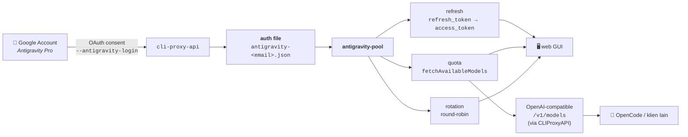

<p align="center">
  
  
  
  
</p>

<h1 align="center">antigravity-pool</h1>
<p align="center"><b>Kelola akun Google Antigravity Pro sebagai pool kredensial OAuth</b><br>
refresh otomatis · monitoring kuota live · rotasi akun · web dashboard</p>

---

## Apa ini?

`antigravity-pool` mengubah satu atau beberapa akun **Google Antigravity Pro**
menjadi *credential pool* yang bisa di-refresh, dimonitor kuotanya, dan
dirotasi — lalu dipakai lewat endpoint OpenAI-compatible (CLIProxyAPI) di
depan model Gemini 3 / Claude Sonnet / GPT.

Tanpa dependency apa pun (pure Python stdlib). Teruji live terhadap akun Pro
(Okt 2026).

---

## 📖 Daftar isi

- [Alur kerja](#-alur-kerja)
- [Quickstart](#-quickstart)
- [Fitur](#-fitur)
- [Struktur proyek](#-struktur-proyek)
- [CLI reference](#-cli-reference)
- [Schema auth file](#-schema-auth-file)
- [Integrasi](#-integrasi)
- [Catatan](#-catatan)

---

## 🔁 Alur kerja



**Ringkasnya:** akun Google → token OAuth → disimpan sebagai JSON →
pool ini yang ngurusin refresh + kuota + rotasi → dipakai lewat endpoint
OpenAI-compatible di OpenCode atau tool apa pun.

---

## ⚡ Quickstart

```bash
# 1. clone
git clone https://github.com/ghostedmyself/antigravity-pool.git
cd antigravity-pool

# 2. (opsional) install
pip install -e .

# 3. set kredensial OAuth (sekali)
cp antigravity/_local_creds.py.example antigravity/_local_creds.py
#    isi ClientID + ClientSecret — nilai publik, lihat [Catatan](#-catatan)
#    ATAU: export ANTIGRAVITY_CLIENT_ID / ANTIGRAVITY_CLIENT_SECRET

# 4. sediakan auth file (copy dari VPS / login akun baru)
#    scp root@VPS:/root/.cli-proxy-api/antigravity-*.json ./auth/
#    ATAU: python -m antigravity.cli login-binary --binary /opt/cli-proxy-api

# 5. jalankan
python -m antigravity.cli status --auth-dirs ./auth
python -m antigravity.cli quota  --auth-dirs ./auth
python -m antigravity.cli gui    --auth-dirs ./auth   # → http://127.0.0.1:8390
```

---

## ✨ Fitur

| Kategori | Fitur | Modul |
|---|---|---|
| 🔑 **OAuth** | refresh token otomatis, login akun baru, userinfo | `oauth.py` |
| 📊 **Kuota** | `fetchAvailableModels` live, snapshot JSON, cache | `quota.py` |
| 🔄 **Rotasi** | round-robin thread-safe, auto-skip akun mati, auto-refresh | `rotate.py` |
| 💾 **Storage** | model auth file CLIProxyAPI-compatible, scan + expiry | `store.py` |
| 🖥️ **GUI** | dashboard web zero-dep, quota bar + token chip + refresh 1-klik | `web.py` |
| ⌨️ **CLI** | `status` / `quota` / `refresh` / `gui` / `login-binary` | `cli.py` |

---

## 📁 Struktur proyek

```
antigravity-pool/
├── antigravity/                 # paket inti (stdlib only)
│   ├── constants.py             #   OAuth client + endpoint (publik)
│   ├── store.py                 #   model & scan auth file
│   ├── oauth.py                 #   refresh / login / userinfo
│   ├── quota.py                 #   fetchAvailableModels + snapshot
│   ├── rotate.py                #   round-robin rotator
│   ├── web.py                   #   dashboard web zero-dep
│   ├── cli.py                   #   antarmuka command-line
│   ├── _local_creds.py.example  #   template kredensial (GITIGNORED)
├── examples/
│   └── opencode.json            # config provider OpenCode siap pakai
├── docs/
│   └── opencode.md              # panduan integrasi OpenCode
├── pyproject.toml               # metadata paket
├── LICENSE                      # MIT
└── README.md
```

---

## 🛠️ CLI reference

| Perintah | Fungsi |
|---|---|
| `status` | tampilkan state token tiap akun (ok / expired / disabled) |
| `quota` | ringkasan kuota per akun; `--out file.json` untuk snapshot penuh |
| `refresh` | refresh semua token yang expired |
| `gui` | jalankan dashboard web (`--host` / `--port`) |
| `login-binary` | tambah akun baru lewat flow login bawaan `cli-proxy-api` |

Semua perintah menerima `--auth-dirs DIR [DIR ...]` untuk menunjuk lokasi
auth file (default `/root/.cli-proxy-api*` di server).

---

## 📄 Schema auth file

Satu file per akun, **CLIProxyAPI-compatible** (drop-in):

```jsonc
{
  "access_token":  "ya29.…",              // token akses (diputar oleh oauth.py)
  "disabled":      false,                 // skip dari rotasi
  "email":         "user@gmail.com",      // identitas akun
  "expired":       "2026-10-01T13:01:06Z",// ISO8601 UTC, di-parse store.py
  "expires_in":    3599,                  // detik
  "project_id":    "aicode-consumers",    // project Google tetap
  "refresh_token": "1//0g…",              // RAHASIA — jaga dir 0700
  "timestamp":     1790856067175,         // epoch ms
  "type":          "antigravity"          // identitas provider
}
```

---

## 🔌 Integrasi

### OpenCode

Endpoint OpenAI-compatible dari CLIProxyAPI bisa langsung dipakai OpenCode:

```bash
opencode run "Explain this codebase" --model antigravity/claude-sonnet-4-6
```

Config lengkap di [`examples/opencode.json`](examples/opencode.json),
panduan di [`docs/opencode.md`](docs/opencode.md).

### CLIProxyAPI

`cli-proxy-api` mengonsumsi auth file yang sama dan mengekspose
`/v1/models` + chat completions:

```yaml
# /opt/cliproxy-config.yaml
host: 127.0.0.1
port: 8317
auth-dir: /root/.cli-proxy-api
api-keys: ["sk-…"]
```

### Library

```python
from antigravity.store import load_accounts
from antigravity.rotate import Rotator
from antigravity.quota import pool_quota

accounts = load_accounts(["/root/.cli-proxy-api"])
rot = Rotator(accounts)        # auto-refresh + skip akun mati
acct = rot.next()              # round-robin, thread-safe
print(pool_quota([acct]))
```

---

## 📝 Catatan

- **Kredensial OAuth (ClientID/ClientSecret) bersifat publik** — nilai ini
  embedded di IDE Antigravity dan dipublikasikan di upstream open-source
  (router-for-me/CLIProxyAPI). Yang rahasia cuma `refresh_token` milikmu;
  simpan auth dir dengan permission `0700`.
- **`remainingFraction`** adalah metrik kuota asli Antigravity (0..1 per
  model); reset-nya rolling window yang dilaporkan lewat `resetTime`.
- **Login akun baru** butuh binary `cli-proxy-api` (flag `--antigravity-login`)
  karena flow OAuth-nya dibangun di sana, bukan di-reimplementasi di sini.

---

## 📄 License

[MIT](LICENSE) © 2026 Omni.labs
